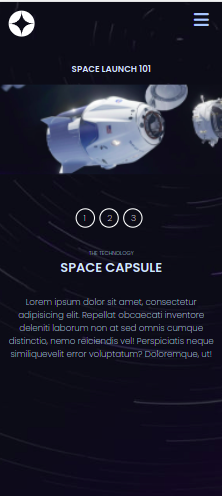
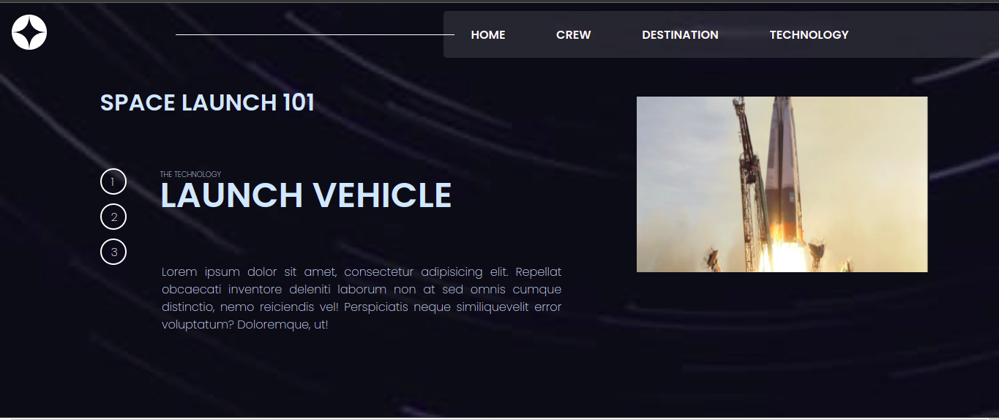

# space-tourism
# Frontend Mentor - Space tourism website

##Here is the solved challenge in picture and below you will see the demo version.

## Welcome! 👋

[Frontend Mentor](https://www.frontendmentor.io) challenges help you improve your coding skills by building realistic projects. Our challenges are perfect portfolio pieces, so please feel free to use what you create in your portfolio to show others.

**To do this challenge, you need a strong understanding of HTML, CSS, and JavaScript.**

## The challenge

Your challenge is to build out this multi-page space tourism website and get it looking as close to the design as possible.
## Building your project

Feel free to use any workflow that you feel comfortable with. Below is a suggested process, but do not feel like you need to follow these steps:

1. Separate the `starter-code` from the rest of this project and rename it to something meaningful for you. Initialize the codebase as a public repository on [GitHub](https://github.com/). Creating a repo will make it easier to share your code with the community if you need help. If you're not sure how to do this, [have a read-through of this Try Git resource](https://try.github.io/).
2. Configure your repository to publish your code to a web address. This will also be useful if you need some help during a challenge as you can share the URL for your project with your repo URL. There are a number of ways to do this, and we provide some recommendations below.
3. Look through the designs to start planning out how you'll tackle the project. This step is crucial to help you think ahead for CSS classes to create reusable styles.
4. Before adding any styles, structure your content with HTML. Writing your HTML first can help focus your attention on creating well-structured content.
5. Write out the base styles for your project, including general content styles, such as `font-family` and `font-size`.
6. Start adding styles to the top of the page and work down. Only move on to the next section once you're happy you've completed the area you're working on.

View my results .[Here](https://iambenkis.github.io/space-tourism/) For a demo version

**Have fun building!** 🚀

